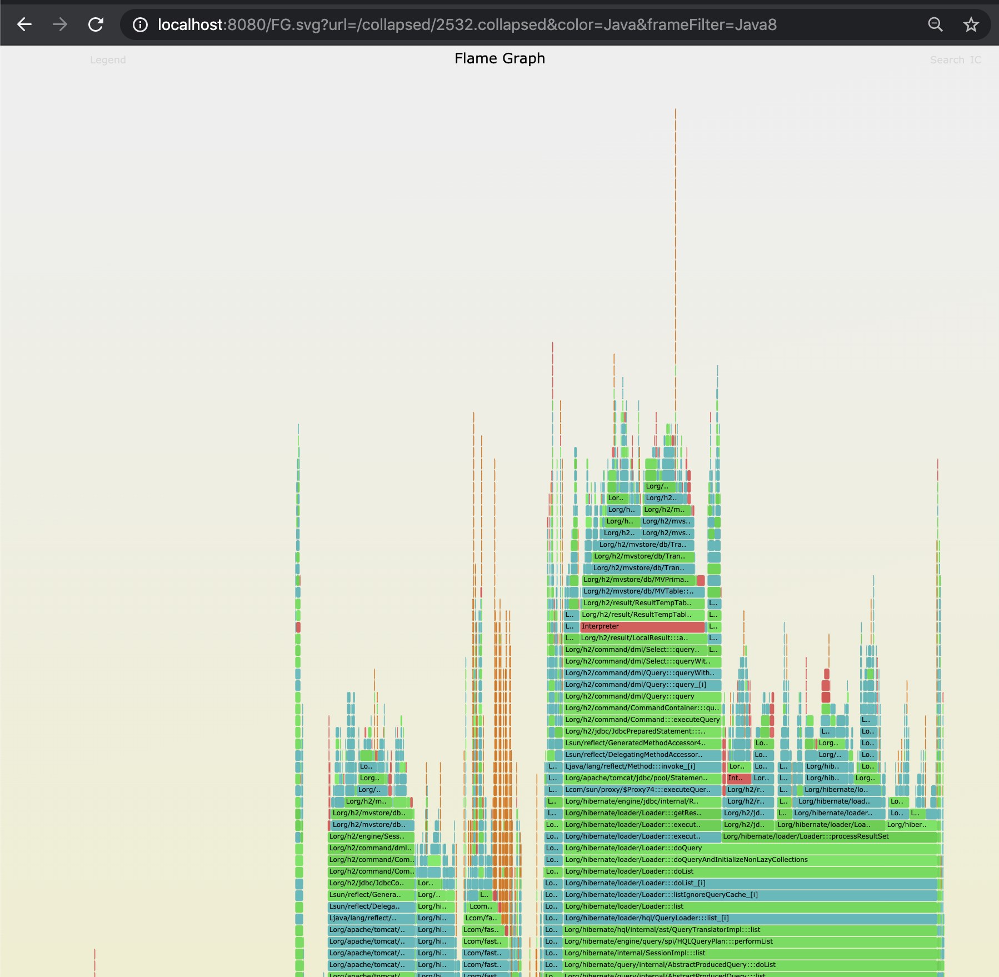
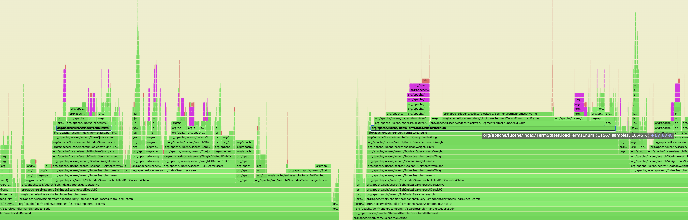
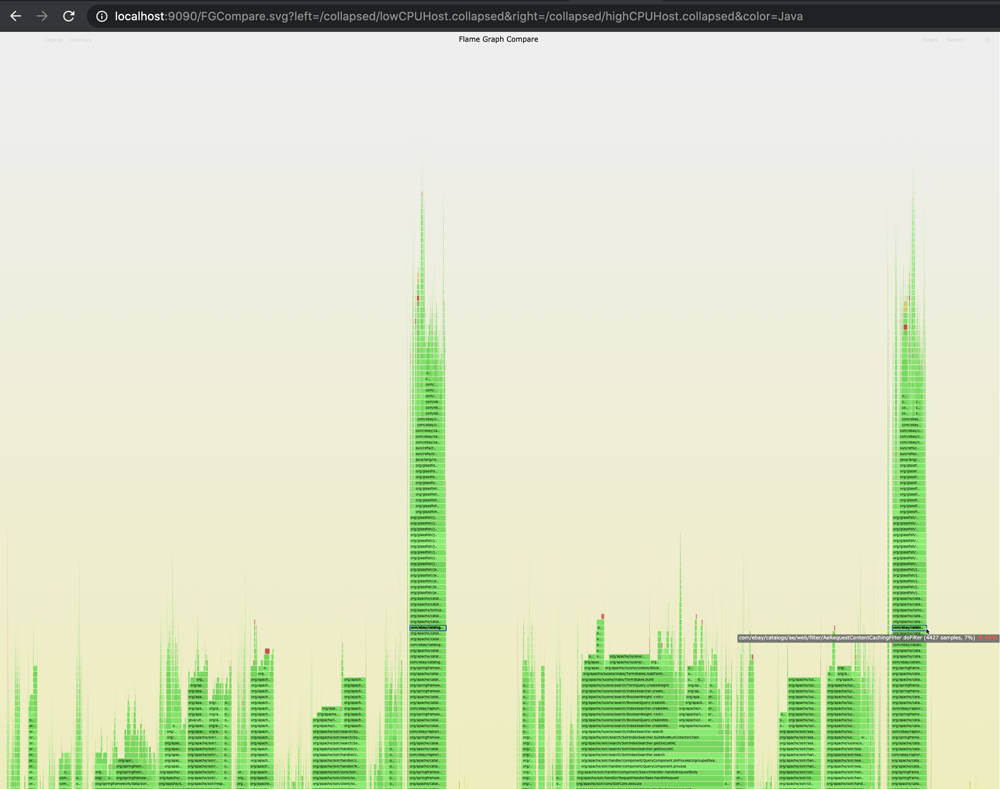
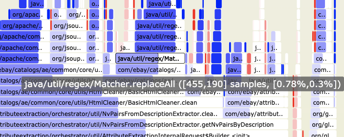
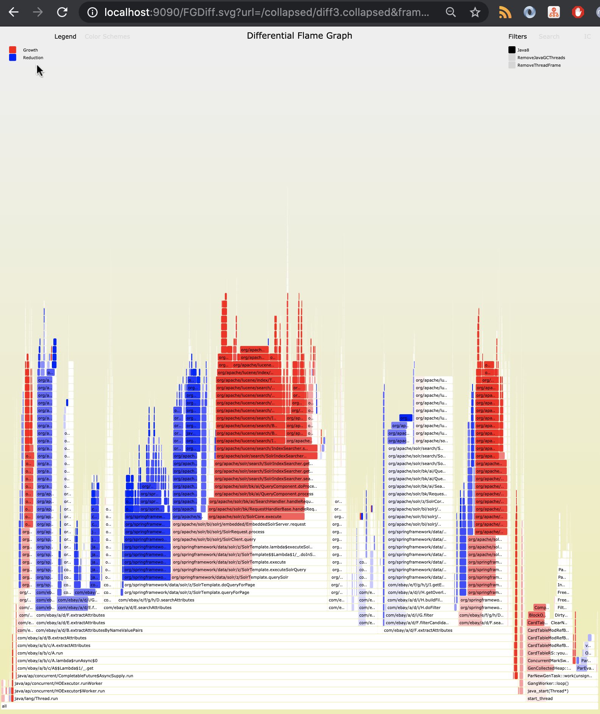
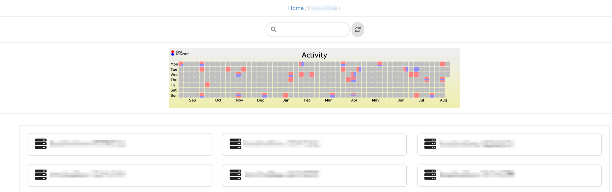
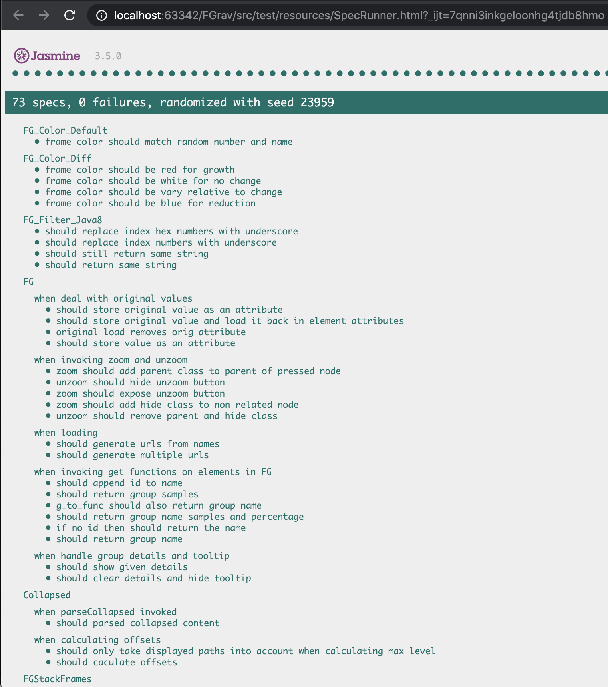

# FGrav
Flamegraph visualizations and related tools implemented in Javascript. 

This vanilla Javascript library is designed to **dynamically** create **[Flamegraph](https://github.com/brendangregg/FlameGraph)** and Flamegraph related visualizations in the browser from the **raw** [collapsed](./src/test/resources/collapsed/java.collapsed) file.

Because the FGrav visualizations are done dynamically within the browser, it offers a lot more customization options and allows a user to create many interactive features unavailable with a conventional SVG file. 

As shown in this project, FGrav also provides a basis to compare related data visually by easily extending or embedding the JS flamegraph implementation - See [FlameGraph comparison](#flamegraph-compare) and a [FlameGraph diff](#flamegraph-diff) views.  

__Created By:__ [Amir Langer](https://github.com/langera/)

__License:__ [Apache 2.0](LICENSE.txt)

__Thanks:__
  * Inspiration:
    * Brendan Gregg's [Flamegraph](https://github.com/brendangregg/FlameGraph) reference implementation
    * Mark Price's [grav](https://github.com/epickrram/grav) profiling results visualizations 
  * Dependencies: 
    * [JQuery](https://jquery.com/)
    * (Test code only) [Jasmine](https://jasmine.github.io/)

__Visualizations:__
  * [FlameGraph](#flamegraph)
  * [FlameGraph Compare](#flamegraph-compare)
  * [FlameGraph Diff](#flamegraph-diff)   <!--  * [FlameGraph Transition](#flamegraph-transition) -->
  * [Calendar View](#calendar-view)
  
__Usage:__  
  * [Test](#test)
  * [Customizable Features](#features)
       * [Color Scheme](#color-scheme)
          * [Built-in color schemes](#built-in-color-schemes)
          * [Custom color schemes](#custom-color-schemes)
          * [Legend](#legend)
       * [Frame Filter](#frame-filter)
          * [Built-in frame filters](#built-in-frame-filters)
          * [Custom frame filters](#custom-frame-filters)
  * [Getting Started](#getting-started)

## FlameGraph

The ability to create the Flamegraph dynamically rather than using a static SVG file allows a lot more flexbility in visualizing and analysing the data such as:
1. dynamic [color scheme](#color-scheme)
1. specific [frame filters](#frame-filter)
1. grouping of code paths (TODO) 

Showing FlameGraph is done by requesting [FG.svg](./src/main/FG.svg).

| Parameter  | Description                                       | Required  |
| ---------- |:-------------------------------------------------:| ---------:|
| url        | url of the collapsed file to visualize            | yes |
| color      | set specific [color scheme](#color-scheme) to use | no |
| frameFilter| set specific [frame filter](#frame-filter) to use | no |
| width      | set width for this visualization in pixels        | no |
| height     | set height for this visualization in pixels       | no |



## FlameGraph Compare

A view of Two FlameGraphs, left and right where the hovering, search and zoom are linked to both and allow the viewer to compare the two side by side.



Showing FlameGraph Comparison is done by requesting [FGCompare.svg](./src/main/FGCompare.svg).

| Parameter  | Description                                       | Required  |
| ---------- |:-------------------------------------------------:| ---------:|
| left       | url of the left side collapsed file to visualize  | yes |
| right      | url of the right side collapsed file to visualize | yes |
| color      | set specific [color scheme](#color-scheme) to use | no |
| frameFilter| set specific [frame filter](#frame-filter) to use | no |
| width      | set width for this visualization in pixels        | no |
| height     | set height for this visualization in pixels       | no |



## FlameGraph Diff

A Differential FlameGraph similar but not identical to the one suggested by [Brendan Gregg](http://www.brendangregg.com/blog/2014-11-09/differential-flame-graphs.html).

Like the original differential FlameGraph, this FlameGraph is also generated from a collapsed file that contains two sample count values for every code path.

See [test_diff.collapsed](./src/test/resources/collapsed/diff.collapsed) for example.

The original suggestion used the difference in measurements to color the frames (blue/red) but the FlameGraph that was drawn was the second measurement.

The main difference in our approach is that our differential FlameGraph show flames which represent the sum of both measurements and color only part of the frame to show the difference between the measurements.

This allows us to:
1. See the difference between the two measurements visually.
1. Avoid having the blind spot of a frame which existed in the first measurement but was not measured at all the second time around.



Showing Differential FlameGraph is done by requesting [FGDiff.svg](./src/main/FGDiff.svg).

| Parameter  | Description                                        | Required  |
| ---------- |:--------------------------------------------------:| ---------:|
| url        | url of the differential collapsed file to visualize| yes |
| color      | set specific [color scheme](#color-scheme) to use  | no |
| frameFilter| set specific [frame filter](#frame-filter) to use  | no |
| width      | set width for this visualization in pixels         | no |
| height     | set height for this visualization in pixels        | no |



<!-- ## FlameGraph Transition -->
<!-- TODO -->

## Calendar View 

Inspired by the [github contributions calendar](https://docs.github.com/en/github/setting-up-and-managing-your-github-profile/viewing-contributions-on-your-profile#contributions-calendar).

Show a calendar view with a color scheme and links to (probably) FlameGraphs that were taken on those days.

Showing a Calendar view is done by requesting [CG.svg](./src/main/CG.svg).

| Parameter  | Description                                       | Required  |
| ---------- |:-------------------------------------------------:| ---------:|
| url        | url of the calendar events json file to visualize. The json must be an array of objects which must contain the following fields: date, type, region, samples, url. see [test example](./src/test/resources/events/test.json) | yes|
| color      | set specific [color scheme](#color-scheme) to use | no |
| width      | set width for this visualization in pixels        | no |
| height     | set height for this visualization in pixels       | no |

This view can be used to show previously captured FlameGraphs for a specific process/service or instance of it by day.   




## Test

All logic is tested using [Jasmine](https://jasmine.github.io/).
We use the [core jasmine](https://github.com/jasmine/jasmine) library and its [jasmine-ajax](https://github.com/jasmine/jasmine-ajax) extension.

To run tests: 

1. Install jasmine and jasmine-ajax js files locally under the lib directory. see [here](lib/README.md) for details. 
2. Load your local copy of [SpecRunner.html](./src/test/resources/SpecRunner.html) in your browser of choice.

For example:



## Features

### Color Scheme

Unlike a static SVG which was created with a pre-determined color scheme, FGrav FlameGraphs SVG visualization is built to work in the browser and therefore we can control and modify the color scheme, and easily see the same data with a different scheme, which allows different "angles" on the data.

color scheme is implemented as a function
 
`function colorFor(frame, totalSamples)`

from a frame object and optional number of samples to a string that represent a color e.g.

`red`

or

`"rgb(" + r + "," + g + "," + b + ")"`

utility function in FGravDraw.js

`function colorValueFor(palette, name, value)`

can be used to generate color values from a palette 
(supported values: "red", "green", "blue", "yellow", "purple", "aqua", "orange")
and optional name, value which are used to generate a consistent shade = variance to the color where it will have the exact same shade for the same name / value.

All FlameGraph SVG files accept parameter `color` as the name/path of the color scheme.
If color parameter is provided, on FG*.svg files, the code will attempt to load a JS file `js/color/FG_Color_${color}.js` where `${color}` is the value of the color parameter.
If that value started with a `/` then the code assumes this is a full path for the JS file and tries to load it. 

If no color parameter is defined on the HTTP request then 'Default' color scheme is used.

#### Built-in color schemes

1. [Default](./src/main/js/color/FG_Color_Default.js) - default. random color
1. [Diff](./src/main/js/color/FG_Color_Diff.js) - Color scheme for "growth" / "reduction" in frame
1. [Java](./src/main/js/color/FG_Color_Java.js) - Java specific color scheme
 
#### Custom color schemes

To build a custom color scheme, simply implement your own color scheme JS function.
Built-in functions can serve as an exammple of how to implement a color scheme JS file.
It must contain a function that returns the color given the frame and number of samples.
It must also set global var `colorScheme.colorFor` to your function.  
Optionally you can also define a legend for your color scheme by setting an object (map of color to name) to `colorScheme.legend`.
  
Loading the color scheme JS file can be done by either:

1. name your JS file using the following the pattern used for built-in functions (i.e. `js/color/FG_Color_${my_color}.js`) then dynamically request the `FG*.svg` file with parameter `color=${my_color}` (where `${my_color}` is the name for your color scheme).
1. name your JS file to any name you want and request the `FG*.svg` file with parameter `color=/${my_color}` (where `${my_color}` is the name for your file) Note `/` at start of parameter value.

#### Legend

This is an additional feature on top of the custom FlameGraph layout born out of the ability to dynamically switch between color schemes.

You can specify a legend for any color scheme by setting colorScheme.legend with a legend object e.g.:

```
colorScheme.legend = {
    lawngreen: 'Java',
    yellow: 'JVM (C++)',
    aqua: 'Inlined',
    orange: 'Kernel',
    red: 'User'
};
```

See [Java](./src/main/js/color/FG_Color_Java.js) color scheme for an example.

The legend is hidden by default but can be toggled by clicking on the **legend** button.


### Frame Filter

Dynamic Frame filter is a function called when parsing the collapsed file to separate code paths.

It can be used to filter entire paths  or manipulate the code path / stack trace before calculating the FlameGraph structure.

FGrav allows a user to define **multiple** frame filters for any FlameGraph. 
All FGrav SVG files accept a parameter `frameFilter` as a comma separated list of names/paths of the filters to use.

#### Built-in Frame Filters

1. [Default](./src/main/js/frame/FG_Filter_Default.js) - default. No-op.
1. [Java8](./src/main/js/frame/FG_Filter_Default.js) - Attempts to solve issue happening in Java 8+ when using `-XX:+UnlockDiagnosticVMOptions -XX:+ShowHiddenFrames` in Java. Without it you will not see lambdas as part of the stack trace, with those flags lambdas will show up as frames but it also assigns arbitrary numbers to lambdas which turn many occurrences of the same lambda code to show up in the stack trace as different frames. This frame filter will remove that arbitrary number causing the FlameGraph to show all those lambdas as the same frame. This is incredibly important in comparisons visualizations and aggregations.
1. [RemoveJavaGCThreads](./src/main/js/frame/FG_Filter_Default.js) - Removes all code paths related to running of Java GC processes.
1. [RemoveThreadFrame](./src/main/js/frame/FG_Filter_RemoveThreadFrame.js) - Removes the thread frame (first frame of any code path) which will consolidate all common paths from different threads into the same flame.

#### Custom Frame Filters

Just like the built-in filters, users can write their own filters in a JS file and load it.

Loading the filter JS file can be done by either:

1. Use the pattern used for built-in functions (i.e. `js/frame/FG_Filter_${my_filter}.js`) then dynamically request the `FG*.svg` file with parameter `frameFilter=${my_filter}` (where `${my_filter}` is the name for your frame filter).
2. Name your JS file to any name you want and request the `FG*.svg` file with parameter `frameFilter=/${my_filter}` (where `${my_filter}` is the name for your file) Note `/` at start of parameter value.

## Getting Started

Deploy all src files and libs to an http server.

You can use [deploy.sh](./deploy.sh) as an example which will create a directory called **web** and copy all files to it.
You can then run an http server via docker with [serve.sh](./serve.sh).

Once the http server is up, request an SVG file from it on a browser.

For example:

`http://${host}:${port}/index.html`

`http://${host}:${port}/FG.svg?url=${raw-file}`

`http://${host}:${port}/FG.svg?url=${raw-file}&color=Java`

`http://${host}:${port}/FG.svg?url=${raw-file}&color=Java&frameFilter=Java8,RemoveJavaGCThreads`

`http://${host}:${port}/FG.svg?url=${raw-file}&color=${custom-color-scheme}&frameFilter=${custom-frame-filters}`

`http://${host}:${port}/FGCompare.svg?left=${raw-file1}&right=${raw-file2}`

`http://${host}:${port}/FGCompare.svg?left=${raw-file1}&right=${raw-file2}&color=Java`

`http://${host}:${port}/FGCompare.svg?left=${raw-file1}&right=${raw-file2}&color=Java&frameFilter=Java8,RemoveJavaGCThreads`

`http://${host}:${port}/FGCompare.svg?left=${raw-file1}&right=${raw-file2}&color=${custom-color-scheme}&frameFilter=${custom-frame-filters}`

`http://${host}:${port}/FGDiff.svg?url=${diff-raw-file}`

`http://${host}:${port}/FGDiff.svg?url=${diff-raw-file}&color=Diff`

`http://${host}:${port}/FGDiff.svg?url=${diff-raw-file}&color=Java&frameFilter=Java8,RemoveJavaGCThreads`

`http://${host}:${port}/FGDiff.svg?url=${diff-raw-file}&color=${custom-color-scheme}&frameFilter=${custom-frame-filters}`

# License Information
Copyright 2020 eBay Inc.

Licensed under the Apache License, Version 2.0 (the "License"); you may not use this file except in compliance with the License. You may obtain a copy of the License at

https://www.apache.org/licenses/LICENSE-2.0

Unless required by applicable law or agreed to in writing, software distributed under the License is distributed on an "AS IS" BASIS, WITHOUT WARRANTIES OR CONDITIONS OF ANY KIND, either express or implied. See the License for the specific language governing permissions and limitations under the License.
